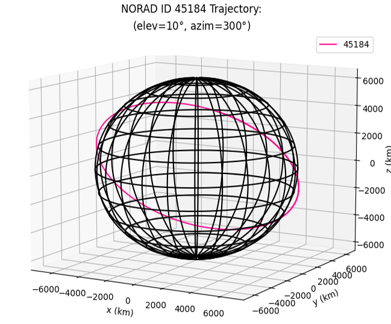

# Starlink TLE Propagation
Simple visualisation scripts/notebooks in Python for propagating Starlink satellite trajectories and simulating orbits around a simplified 3-D Earth model (with no oblateness).

